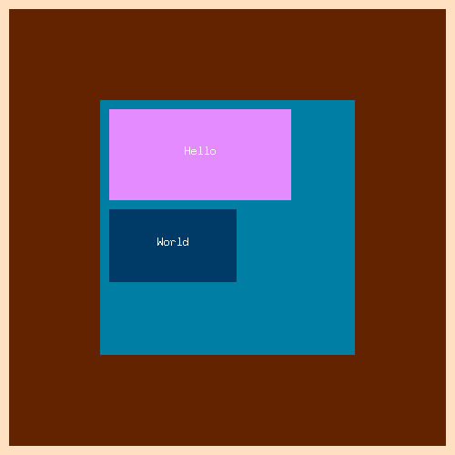

# Pandora 🏺✨

Pandora is toy browser engine written in Golang.
Because why not?

(I just wanted to know how browser render stuff, so I tried to build a browser engine that receives `html` and `css` and outputs a `png`).

Okay. There's no fancy stuff like positioning, z-indexes, flexbox etc... it's very basic.
It was really complex (for my level) and forgive me for errors in advance. Any contribution is welcomed!!



Anyway you can play around with the `html` structure and the `css` rules (top, left, background-color)

# Why ❓

Why not?

Joke... I've built Pandora because I wanted to learn how browser renders web pages (and it is really complicated). 
<strong>So Pandora was built for LEARNERS.</strong>

> I tried to document each section of the code as much as I could (I'm still doing it) with link to resources I've studied while building this, but if you want to improve it, feel free to open issues and pull requests.

# How it works ❓

Reading this amazing articles about building a <a href="https://limpet.net/mbrubeck/2014/08/08/toy-layout-engine-1.html" target="_blank">Browser engine</a> I decided to try to build one in Go (as I do not know anything about Rust).

- Pandora takes a `.html` and `.css`files (or string if used in the browser)
- Builds the `DOM tree` and a very basic `CSSOM`
- Builds a `Render Tree` from the two
- Builds a `Layout Tree` from the Render Tree
- Creates a `Display List`
- Renders, creating a `.png` image

# How to use ❓

To render the html and css in `example/*`

```bash
pandora --html example/example.html --css example/example
```

Pandora supports `background-color` `top` `left` `margin` `margin-top` etc...
Follow the Css sample.
Obviously you can contribute whenever you want to make Pandora support more stuff !!

# Requirements ✋

- Go
- Make

# Roadmap

1. <h3>Fonts</h3>
2. <h3>Display block / inline / inline - block</h3>

3. <h3>Wasi support</h3>

# Contributing

To contribute simply 
- create a branch with the feature or the bug fix
- open pull requests

Pandora is by no means finished there are a lot of things that can be implemented and A LOT of things that can be improved. Any suggestions, pull requests, issues or feedback is greatly welcomed!!!